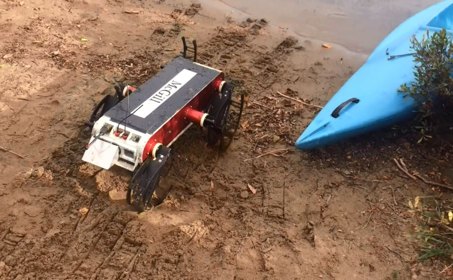
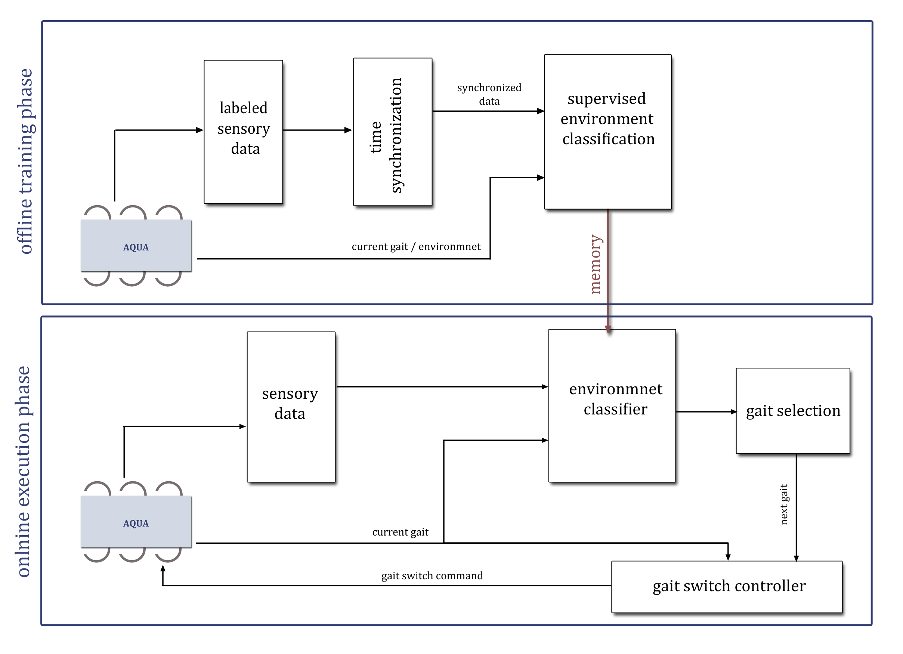

## Intro

Legged robots who possess a variety of gait patterns are usually able to navigate over different terrains and environments. Humans intuitively know how to adjust their walking behavior to the surface, they are walking on, in order to walk more stable and efficient. For example, we tend to walk flat-footed and more slowly on the ice, compared to when we walk on the ground. Similarly, legged robots should utilize different gait patterns to ensure stability and energy-efficiency. For an amphibious robot, it is even more critical to select the appropriate gaits for its environment to navigate safely. For example, a robot that moves from a sand beach to deep water should have the ability to switch from walking to swimming as it enters the water. Failure to switch gaits in response to environmental changes may cause destructive damage to the robot. We believe that in order for the robots to perform smooth transitions between different gaits, they need to first differentiate various types of environments and terrains. With the ability to identify its surrounding, the robot can select the most adequate gait for its current environment.

Our robot, Aqua, is a hexapod with six independently-controlled leg actuators that are designed for amphibious locomotion. The robot utilizes several modes that determine the legs' movement pattern, including walking and swimming modes. We aim to enable the Aqua robot to switch gaits autonomously when entering and exiting water. We should be able to give it a couple of waypoints or tasks in both land and water and be sure that it can switch modes and transition between the two environments safely when needed.

## Approach

We design a gait controller to decide on the desire to switch gaits by analyzing the inertial and actuator information. We argue that interaction forces between the robot legs and the ground are a promising indicator of the surface mechanical properties. Therefore, we utilize inertial sensor and actuator feedback to probe and estimate the environment and switch gaits accordingly when entering and exiting the body of water.

The proposed approach consists of two phases. In the offline supervised training phase, the model learns to identify the environment, which the robot is approaching, and the appropriate gait based on the labeled sensory data. The training labeled data is gathered when navigating in each of the two environments while manually controlling the gait selection. The classifier parameters are stored in memory for use in real-time autonomous gait switching. During the online execution phase, sensory data is recorded and classified as one of the labeled environments and its corresponding gait. The selected gait is fed back into the robot to adapt the robot's behavior in real-time.

The input to our deep learning model is a window of past states. It takes the acceleration along each of the 3 axis, leg motor currents, and the current gait identifier for the last T seconds and predicts what is the gait that the robot will be using in some time in the future.

## Experiments

The Aqua robot operates on Robot Operating System (ROS) and the proposed algorithm is implemented in python. We carried out several experiments with the Aqua robot and collected sensory information while the robot navigates on different terrains and switches gaits. The gait selection model is trained and tested on the gathered real-world data sources on a ROS server. The collected ROS bag files contain the linear accelerations, leg motor currents, forward and downward view images along with the manual mode change information.

We evaluate different choices for the parameters of the model using accuracy on the validation set as the benchmarking metric. The gait adaptation algorithm performs efficiently well, and the switch decision was made at the correct time intervals when the robot is close to the seashore.